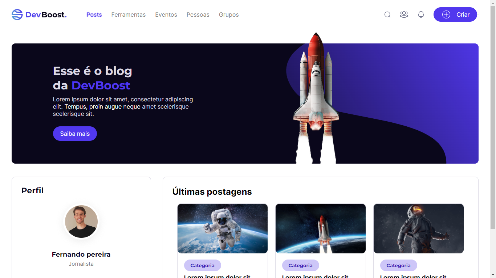

# Desafio-devBoost2

## Sobre o projeto:
Desafio proposto pela [DevBoost.](https://www.instagram.com/Dev_Boost/)

[🔗 Clique aqui para acessar](https://andersonrodrigs.github.io/Desafio-1-DevBoost/)

## 🛠 Tecnologias:
- HTML
- CSS
- JavaScript

## 🔖 Layout

Você pode visualizar o layout do projeto através [DESSE LINK](https://www.figma.com/file/rYBqcSF8x7VsfBCz2cosF4/Challenge---DevBoost?node-id=11%3A2). É necessário ter conta no [Figma](https://figma.com) para acessá-lo.

